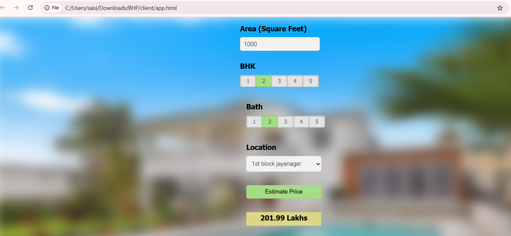

## HousePricePredict
Regression Project: Predicting Home Prices in Bangaluru
This is a simple machine learning project I built to **predict housing prices in Bangalore** based on user inputs such as square foot, number of bedrooms, bathrooms, and location. I also designed a complete **web interface using HTML, CSS, and JavaScript** with a Flask backend to serve predictions.

## Features 
- Interactive frontend using HTML, CSS, JS (jQuery)
- Flask backend with a trained regression model
- Real-time predictions using user input
- Location dropdown dynamically loaded from backend
## Tech Stack
- Frontend: HTML5, CSS3, JavaScript, jQuery
- Backend: Python, Flask
- ML: Scikit-learn, Pandas, NumPy
- Deployment: (e.g. Render/Heroku or local)
## How it works
- Model trained on a cleaned housing dataset.
- Features used: location (one-hot encoded), total_sqft, BHK, bath.
- Backend serves predictions via `/predict_home_price`.
## What I Learned
- How to clean and preprocess real-world datasets
- How to train a regression model using Scikit-Learn
- How to save and load models using Pickle
- How to create a backend using Flask
- How to connect the model to a frontend using JavaScript and API calls
- How to build a simple user interface for real-time predictions

- ## Getting Started
- ### 1. Clone the repo
- bash git clone https://github.com/Vijayasai66/HousePricePredict.git
cd HousePricePredict
### 2. Install dependencies
pip install -r requirements.txt
### 3. Run the backend(Flask)
python server.py
### 4. Open the UI
Just open client/app.html in your browser.

### PROJECT STRUCTURE
HousePricePredict/
│
├── client/
│   ├── app.html       # Web UI
│   ├── app.css        # Styling
│   └── app.js         # JavaScript logic
│
├── server.py          # Flask API
├── util.py            # Model prediction logic
├── artifacts/         # Saved model & data
│   ├── bangalore_home_prices_model.pickle
│   └── columns.json
├── requirements.txt   # Python dependencies
├── README.md
└── .gitignore
